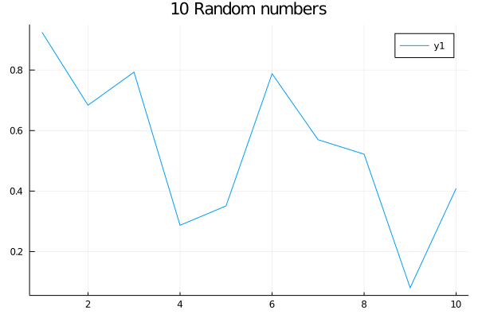

# Jurassic.pl (侏逻辑)

Call Julia code from Prolog

# Prerequisite

- [Julia](https://github.com/JuliaLang)
- [SWI-Prolog (devel)](https://github.com/SWI-Prolog/swipl-devel)

This package is only tested on Linux, not sure if it will compile on MacOS
(maybe) or Windows (very unlikely).

# Build

Just run `make` directly.
``` shell
make
```

To debug the package, please uncomment the `#defeine JURASSIC_DEBUG` in
`c/jurassic.h`.

# Usage

Load `jurassic` module in SWI-Prolog:

``` prolog
?- use_module(jurassic).

```

## Julia Expressions
Run Julia expression in Prolog with symbol `:=`:

``` prolog
?- := println("Hello World!").
% output
Hello World!
true.

?- a := sqrt(2.0),
     := println(a).
1.4142135623730951
true.
```

## Julia Functions
Define a function and call a Julia macro:

``` prolog
?- := f(x) = x*transpose(x).
true.

?- := @show(f([1,2,3,4,5])).
f([1, 2, 3, 4, 5]) = [1 2 3 4 5; 2 4 6 8 10; 3 6 9 12 15; 4 8 12 16 20; 5 10 15 20 25]
true.
```
Array reference with `[]`:

``` prolog
?- a := f([1,2,3,4,5]).
true.

?- X = 2, := @show(a[1,X]).
a[1, 2] = 2
X = 2.

?- X = 100, := @show(a[1,X]).
BoundsError: attempt to access 5×5 Array{Int64,2} at index [1, 100]
false.
```

Define complicated functions with string:

``` prolog
?- := "fib(n) = n <= 1 ? 1 : fib(n-1) + fib(n-2)".
true.

?- := @time(@show(fib(46))).
fib(46) = 2971215073
  7.567550 seconds (3.97 k allocations: 228.485 KiB)
true.
```

Multiple lines also work:

``` prolog
?- := "function fib2(n)
         n <= 1 && return 1
         sum = 0
         while n > 1
             sum += fib2(n-1)
             n -= 2
         end
         return sum + 1
     end".
true.

?- := @time(@show(fib2(46))).
fib2(46) = 2971215073
  4.409316 seconds (60.55 k allocations: 3.183 MiB)
true.
```

Similar program in Prolog (**without tabling for memorising**) takes much more time:

``` prolog
fib_pl(N, 1) :-
    N =< 1, !.
fib_pl(N, X) :-
    N1 is N-1, fib_pl(N1, X1),
    N2 is N-2, fib_pl(N2, X2),
    X is X1 + X2.

% Prolog without tabling
?- time(fib_pl(40, X)).
% 827,900,701 inferences, 55.618 CPU in 55.691 seconds (100% CPU, 14885532 Lips)
X = 165580141.

% Julia in Jurassic
?- := @time(@show(fib(40))).
fib(40) = 165580141
  0.525090 seconds (3.97 k allocations: 228.626 KiB)
true.

?- := @time(@show(fib2(40))).
fib2(40) = 165580141
  0.296593 seconds (6.86 k allocations: 392.581 KiB)
true.
```

`Jurassic.pl` also supports Julia's `'Package'.function` calls. The `'Package'`
is quoted as a Prolog atom, otherwise uppercase words are treated as Prolog
variables.

``` prolog
?- jl_using("Pkg").
true.

?- := 'Pkg'.status().
    Status `~/.julia/environments/v1.2/Project.toml`
  [336ed68f] CSV v0.5.12
  [159f3aea] Cairo v0.6.0
  [324d7699] CategoricalArrays v0.6.0
  ...
true.

```

## Interaction Between Prolog and Julia

Unify Prolog term with Julia expressions:

``` prolog
?- := f(x) = sqrt(x) + x^2 + log(x) + 1.0.
true.

?- X := f(2.0).
X = 7.10736074293304.

% Prolog and Julia work together
?- between(1,10,X),
   Y := f(X).
X = 1,
Y = 3.0 ;
X = 2,
Y = 7.10736074293304 ;
X = 3,
Y = 12.830663096236986 ;
...
...
```

Unification with 2d-array will fail:

``` prolog
?- := f(x) = x*transpose(x).
true.

?- X := f([1,2,3]).
[ERR] Cannot unify list with matrices and tensors!
false.
```

## Julia Package and Source Files

Import Julia packages or source files:

``` prolog
?- jl_using("Flux").
?- jl_include("my_source_file.jl").
```

## Julia Constants and Keywords
Julia constants:

``` prolog
% Jurassic.pl
?- X := 1/0.
X = inf.

?- X := -1/0.
X = ninf.

% Prolog
?- X is 1/0.
ERROR: Arithmetic: evaluation error: `zero_divisor'
ERROR: In:
ERROR:   [10] _6834 is 1/0
ERROR:    [9] <user>
```

Tuples are defined with `tuple/1` predicate:

``` prolog
?- a := tuple([1,2,3,"I'm string!",tuple([2.0,"is a double"])]),
     := @show(a).
a = (1, 2, 3, "I'm string!", (2.0, "is a double"))
true.
```

Currently, the unification only works for 1d-arrays:

``` prolog
?- := f(x) = pi.*x.
true.

?- X := f([1,2,3,4,5]).
X = [3.141592653589793, 6.283185307179586, 9.42477796076938, 12.566370614359172, 15.707963267948966].
```

Keywords assignment in a function calling are defined with `kw/2` predicate:

``` prolog
% Plot with Jurassic.pl using Plots.jl
?- jl_using("Plots").
true.
% Use backend GR
?- := gr().
true.
% Use kw/2 to assign values to keywords,
% This command is equals to Julia command:
%     "plt = plot(rand(10), title = "10 Random numbers", fmt = :png, show = false))".
?- plt := plot(rand(10), kw(title, "10 Random numbers"), kw(fmt, :png), kw(show, false)).
true.
% Save the plot.
?- := savefig(plt, "rand10.png").
true.
```



# TODO
More features to be added, e.g.:

- Multi-dimension arrays;
- Multi-threading.

# Acknowledgement

The `Jurassic.pl` package is inspired by
[real](https://www.swi-prolog.org/pack/file_details/real/prolog/real.pl)
(calling R from Prolog).

Another similar package is
[pljulia](https://www.swi-prolog.org/pack/file_details/pljulia/prolog/julia.pl),
unfortunately it is deprecated and only has limited functionalities.

# Author

__Wang-Zhou Dai__ ([homepage](http://daiwz.net))<br/>
Department of Computing<br/>
Imperial College London
