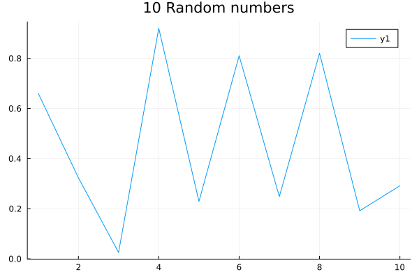

# Jurassic.pl (侏逻辑)

Run Julia codes in Prolog.

- Prolog is a powerful logic programming language designed for automating
first-order logical reasoning.
- [Julia](https://julialang.org/) is
a [highly-efficient](https://julialang.org/benchmarks/) Python-like programming
language designed for data science, machine learning and scientific domains.

Naming of this software: "**JU**lia in **LOGIC** programming" ⇒ (translation)
"**茱**莉娅 + **逻辑**程序" ⇒ (acronym) "茱逻辑" ⇒ (Mandarin pronunciation) "zhū
luó jì" ⇒ (pronounce) "**侏**罗纪" ⇒ (translate) "**Jurassic**".

# Prerequisites

Install SWI-Prolog and Julia, make sure `swipl-ld` and `julia` is in your `PATH`.

- [SWI-Prolog](https://www.swi-prolog.org/) (tested with swipl-8.2.3 in Archlinux's community repo. swipl-devel causes problem of freeing invalid pointer when halting)
- [Julia](https://julialang.org/) (tested with julia-1.5.4)
  
This package is only tested on Linux, not sure if it will compile on MacOS
(maybe) or Windows (very unlikely).

# Build

Just run `make`.
``` shell
make
```

To debug the package, please uncomment the `#define JURASSIC_DEBUG` in
`c/jurassic.h`.

# Usage

Load `jurassic` module in SWI-Prolog:

``` prolog
?- use_module(jurassic).

```

## Julia Expressions
Call Julia expressions in Prolog with symbol `:=`:

``` prolog
?- := println("Hello World!").
% output
Hello World!
true.

?- a := sqrt(2.0),
     := println(a).
1.4142135623730951
true.
```

Find out if an atom has been defined in the embedded Julia:

``` prolog
?- jl_isdefined(a).
false.

?- a := 1.
true.

?- jl_isdefined(a).
true.
```

## Julia Functions
Define a function and call a Julia macro:

``` prolog
?- := f(x) = x*transpose(x).
true.

?- := @show(f([1,2,3,4,5])).
f([1, 2, 3, 4, 5]) = [1 2 3 4 5; 2 4 6 8 10; 3 6 9 12 15; 4 8 12 16 20; 5 10 15 20 25]
true.
```
Array element references by `[]`:

``` prolog
?- a := f([1,2,3,4,5]).
true.

?- X = 2, := @show(a[1,X]).
a[1, 2] = 2
X = 2.

?- X = 100, := @show(a[1,X]).
BoundsError: attempt to access 5×5 Array{Int64,2} at index [1, 100]
false.
```

Define more complex functions with command strings by predicate `cmd/1`:

``` prolog
?- := cmd("fib(n) = n <= 1 ? 1 : fib(n-1) + fib(n-2)").
true.

?- := @time(@show(fib(46))).
fib(46) = 2971215073
  7.567550 seconds (3.97 k allocations: 228.485 KiB)
true.
```

Multiple lines also work:

``` prolog
?- := cmd("function fib2(n)
         n <= 1 && return 1
         sum = 0
         while n > 1
             sum += fib2(n-1)
             n -= 2
         end
         return sum + 1
     end").
true.

?- := @time(@show(fib2(46))).
fib2(46) = 2971215073
  4.409316 seconds (60.55 k allocations: 3.183 MiB)
true.
```

Similar program in Prolog (**without tabling for memorising facts**) takes much
more time:

``` prolog
fib_pl(N, 1) :-
    N =< 1, !.
fib_pl(N, X) :-
    N1 is N-1, fib_pl(N1, X1),
    N2 is N-2, fib_pl(N2, X2),
    X is X1 + X2.

% Prolog without tabling
?- time(fib_pl(40, X)).
% 827,900,701 inferences, 55.618 CPU in 55.691 seconds (100% CPU, 14885532 Lips)
X = 165580141.

% Julia in Jurassic
?- := @time(@show(fib(40))).
fib(40) = 165580141
  0.525090 seconds (3.97 k allocations: 228.626 KiB)
true.

?- := @time(@show(fib2(40))).
fib2(40) = 165580141
  0.296593 seconds (6.86 k allocations: 392.581 KiB)
true.
```

### Using Julia Packages

Import Julia packages or source files:

``` prolog
?- jl_using("Flux").
true.

?- jl_include("my_source_file.jl").
true.
```

`Jurassic.pl` also supports Julia's `'Package'.function` field accessing. The
`'Package'` is quoted as a Prolog atom, otherwise uppercase words are treated as
Prolog variables.

``` prolog
?- jl_using("Pkg").
true.

?- := 'Pkg'.status().
    Status `~/.julia/environments/v1.2/Project.toml`
  [336ed68f] CSV v0.5.12
  [159f3aea] Cairo v0.6.0
  [324d7699] CategoricalArrays v0.6.0
  ...
true.

```

It also works with `struct` fields as well:

``` prolog
?- := "struct point
           x
           y
       end".
true.

?- a := cmd("[point([1,2,3],[1,2,3]), point([2,3,4],[2,3,4])]").
true.

?- := @show(a[2].x[1]).
(a[2]).x[1] = 2
true.

```

### Julia `ccall`

One of the most fascinating features of Julia is it can call C/Fortran functions directly
from shared libraries, i.e., the `ccall` function (use `QuoteNode` via `$x`)
([link](https://docs.julialang.org/en/v1/manual/calling-c-and-fortran-code/)).
`Jurassic.pl` also supports it:

``` prolog
% wrapping tuples with predicate tuple/1, passing datatypes (Int32) as atoms:
?- := @show(ccall(tuple([$clock, "libc.so.6"]), 'Int32', tuple([]))).
ccall((:clock, "libc.so.6"), Int32, ()) = 1788465
true.
```

You can also use strings to define `ccall` functions, just remember to use
escape character `\"` to pass string arguments:

``` prolog
?- := cmd("function getenv(var::AbstractString)
    val = ccall((:getenv, \"libc.so.6\"),
                Cstring, (Cstring,), var)
    if val == C_NULL
        error(\"getenv: undefined variable: \", var)
    end
    unsafe_string(val)
end").
true.

?- X := getenv("SHELL").
X = "/bin/zsh".
```

## Interaction Between Prolog and Julia

Unify Prolog terms with Julia expressions:

``` prolog
?- := f(x) = sqrt(x) + x^2 + log(x) + 1.0.
true.

?- X := f(2.0).
X = 7.10736074293304.

% Prolog and Julia work together
?- between(1,10,X),
   Y := f(X).
X = 1,
Y = 3.0 ;
X = 2,
Y = 7.10736074293304 ;
X = 3,
Y = 12.830663096236986 ;
...
```

The unification from Julia side will first try to access the value of Julia
symbol if it is defined variable; if failed, treat the symbol name as an atom:

``` prolog
?- a := 1,
   X := a,
   b := X + 1,
   Y := b,
   Z := c.
X = 1,
Y = 2,
Z = c.
```

__Remark__: `QuoteNode` and `Symbol` are different in Julia. In `Jurassic.pl`,
symbols (`:x`) will be parsed as `Symbol` only and will be called by
`jl_symbol_lookup` to access its value. For `QuoteNode` usage, you should use
`$x`. For example, in the `Tuple` example, to define a tuple contains symbol:

``` prolog
?- a := tuple([2.0, $'I\'m a quoted symbol']),
     := @show(a).
a = (2.0, Symbol("I''m a quoted symbol"))
true.

% wrong usage
?- a := tuple([2.0, :'I\'m a quoted symbol']),
     := @show(a).
UndefVarError: I''m a quoted symbol not defined
false.
```

However, meta-programming requires to use `Symbols` instead of `QuoteNodes`:

``` prolog
?- X = jl_expr(:'=', [:a, jl_expr(:call, [*, 2, 3])]), 
   := eval(X),
   := @show(a).
a = :(2 * 3)
X = jl_expr(: (=), [:a, jl_expr(:call, [*, 2, 3])]).

% wrong usage
:- X = jl_expr(:'=', [$a, jl_expr(:call, [*, 2, 3])]),
   := eval(X), 
   := @show(a).
syntax: invalid assignment location ":a"
false.
```

In order to make the code less ambiguous, please use `QuoteNode` symbol "`:`" if
you do not want to access the value an atom (Julia variable):

``` prolog
?- a := array('Int64', undef, 2, 2).
true.

?- X = a, := @show(X).
a = [0 0; 0 0]
X = a.

?- X = :a, := @show(X).
:a = :a
X = :a.
```

Currently, the unification only works for 1d-arrays:

``` prolog
?- := f(x) = pi.*x.
true.

?- X := f([1,2,3,4,5]).
X = [3.141592653589793, 6.283185307179586, 9.42477796076938, 12.566370614359172, 15.707963267948966].
```

Unification of (>1)d-arrays will fail:

``` prolog
?- := f(x) = x*transpose(x).
true.

?- := @show(typeof(f([1,2,3]))),
   X := f([1,2,3]).
typeof(f([1, 2, 3])) = Array{Int64,2}
[ERR] Cannot unify list with matrices and tensors!
false.
```

## Julia Constants and Keywords
Julia constants as atoms, e.g. `Inf`, `missing`, `nothing`, etc.:

``` prolog
% Jurassic.pl
?- X := 1/0.
X = inf.

?- X := -1/0.
X = ninf.

% Prolog
?- X is 1/0.
ERROR: Arithmetic: evaluation error: `zero_divisor'
ERROR: In:
ERROR:   [10] _6834 is 1/0
ERROR:    [9] <user>
```

Tuples are defined with Prolog predicate `tuple/1`, whose argument is a list:

``` prolog
?- a := tuple([1,"I'm string!", tuple([2.0, $'I\'m a quoted symbol'])]),
     := @show(a).
a = (1, "I'm string!", (2.0, Symbol("I'm a quoted symbol")))
true.
```

Tuples are useful for returning multiple values, when it appears on the left
hand side of `:=`, the atoms in tuples are treated as Julia variables, and
variables are for unification. This is useful when Julia functions return
data in multiple formats, for example, a linear regression model (a `struct`)
with its r2 score (`Float64`) on training data: 

``` prolog
?- := @show(a).
UndefVarError: a not defined
false.

?- := cmd("f(x) = (x, x^2, x^3)").
true.

?- A = a, tuple([A, B, C]) := f(-2).
A = a,
B = 4,
C = -8.

?- := @show(a).
a = -2
true.
```

**Remark**: Tuples are *always* evaluated before unification:

``` prolog
?- a := 1.
true.

?- X := [a, $a].
X = [1, :a].

?- X := tuple([1+1, :a]).
X = tuple([2, 1]).

% TODO $a should be :a
?- X := tuple([1+1, $a]).
X = tuple([2, 1]).
```

Keyword assignments in a function call are represented by the `kw/2` predicate:

``` prolog
% Plot with Jurassic.pl using Plots.jl
?- jl_using("Plots").
true.
% Use backend GR
?- := gr().
true.
% Use kw/2 to assign values to keywords,
% This command is equals to Julia command:
%     "plt = plot(rand(10), title = "10 Random numbers", fmt = :png, show = false))".
?- plt := plot(rand(10), kw(title, "10 Random numbers"), kw(fmt, :png), kw(show, false)).
true.
% Save the plot.
?- := savefig(plt, "rand10.png").
true.
```
Plotted image:



Spreads arguments with `...`:

``` prolog
?- := foo(x,y,z) = sum([x,y,z]).
true.

?- := foo([1,2,3]).
MethodError: no method matching foo(::Array{Int64,1})
Closest candidates are:
  foo(::Any, !Matched::Any, !Matched::Any) at none:0
false.

?- := foo([1,2,3]...).
true.
```

## Anonymous functions

[Anonymous
functions](https://docs.julialang.org/en/v1/manual/functions/#man-anonymous-functions-1)
are useful in second-order functions. `Jurassic.pl` use operator `->>` instead
of `->` because the latter one is the [condition
operator](https://www.swi-prolog.org/pldoc/man?predicate=-%3E/2) in Prolog.
Following is an example of using `->>`:

``` prolog
?- X := map(x ->> pi*x, [1,2,3,4,5]).
X = [3.141592653589793, 6.283185307179586, 9.42477796076938, 12.566370614359172, 15.707963267948966].
```

## Meta-Programming
Julia supports
[meta-programming](https://docs.julialang.org/en/v1/manual/metaprogramming/),
expressions `Expr(head, arg1, arg2, arg3)` are represented with  predicate
`jl_expr/2`:

``` prolog
% Expr(:call, +, 1, 1) form of "b = 1 + 1"
?- X = jl_expr(:'=', [:b, jl_expr(:call, [+, 1, 1])]),
   := eval(X),
   := @show(b).
b = :(1 + 1)
X = jl_expr(: (=), [:b, jl_expr(:call, [+, 1, 1])]).

?- a := jl_expr(:call, [*, :b, :b]), 
   := @show(a).
a = :(b * b)
true.
```

## TODO: Multi-dimension Arrays
Array can be initialised with function `array`, which is equal to `Array{Type,
Dim}(Init, Size)` in Julia:

``` prolog
?- a := array('Float64', undef, 2, 2, 2).
true.

?- := @show(a[1,:,:]).
a[1, :, :] = [2.5e-322 0.0; 0.0 0.0]
true.
```

New arrays can also be initialised with a Prolog predicate `jl_new_array/4` predicates:

``` prolog
% jl_new_array(Name, Type, Init, Size) works like Name = Array{Type, Dim}(Init, Size)
% in Julia, here Size is a list.
?- jl_new_array(a, 'Int', undef, [2, 2, 2]).
true.

?- := @show(a[1,:,:]).
a[1, :, :] = [34359738371 77309411345; 64424509449 140320876527618]
true.
```

Array initialisation also supports [type
unions](https://docs.julialang.org/en/v1/manual/types/#Type-Unions-1) with
predicate `union(Type1, Type2, ...)`:

``` prolog
?- a := array(union('Int64', 'Missing'), missing, 2, 2).
true.

?- a[1, :] := [1,2].
true.

?- := @show(a).
a = Union{Missing, Int64}[1 2; missing missing]
true.
```

At current stage, multiple-dimension arrays cannot be unified with Prolog
variable, so the initialisation only stores the initialised arrays in atoms (as
names of Julia variables).

# TODO
More features to be added, e.g.:

- Unify multi-dimension arrays with Prolog lists;
- Multi-threading.

Compile and test code in other platform, e.g.:

- MaxOS
- Windows

# Acknowledgement

The `Jurassic.pl` package is inspired by
[real](https://www.swi-prolog.org/pack/file_details/real/prolog/real.pl)
(calling R from Prolog).

Another similar package is
[pljulia](https://www.swi-prolog.org/pack/file_details/pljulia/prolog/julia.pl),
unfortunately it is deprecated and only has limited functionalities.

# Author

__Wang-Zhou Dai__ ([homepage](http://daiwz.net))<br/>
Department of Computing<br/>
Imperial College London
